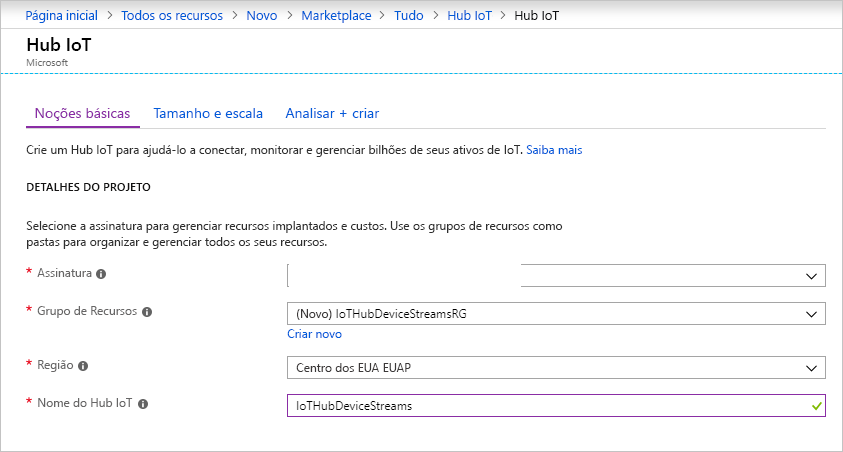
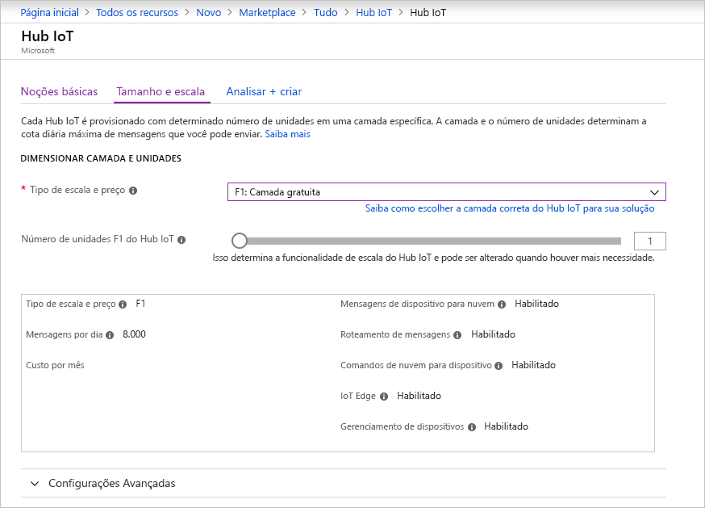
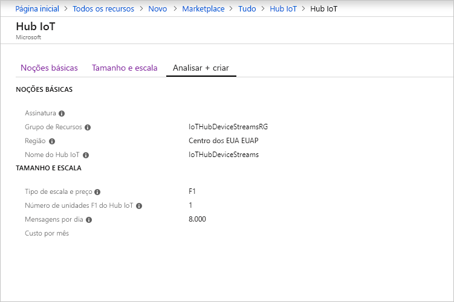

Esta seção descreve como criar um hub IoT usando o [portal do Azure](https://portal.azure.com).

1. Entre no [Portal do Azure](https://portal.azure.com).

1. Selecione **Criar um recurso** e, em seguida, **Internet das Coisas**.

1. Na lista à direita, selecione **Hub IoT**. A primeira página para a criação de um hub IoT será aberta.

   

   Preencha os campos:

   a. Na lista suspensa **Assinatura**, selecione a assinatura a ser usada para o hub IoT.

   b. Para **Grupo de Recursos**, realize uma das seguintes etapas: 
      * Para criar um grupo de recursos, selecione **Criar** e insira o nome que deseja usar. 
      * Para usar um grupo de recursos existente, selecione **Usar existente** e, em seguida, na lista suspensa, selecione o grupo de recursos. 
      
        Para obter mais informações, veja [Gerenciar grupos de recursos do Azure Resource Manager](../articles/azure-resource-manager/manage-resource-groups-portal.md).

   c. Na lista suspensa **Região**, selecione a região na qual deseja que o hub esteja localizado. Selecione uma região que dê suporte à visualização de fluxos de dispositivos do Hub IoT, **EUA Central** ou **EUA Central EUAP**.

   d. Na caixa **Nome do Hub IoT**, insira o nome para o hub IoT. O nome deve ser globalmente exclusivo. Caso o nome inserido esteja disponível, uma marca de seleção verde será exibida.

   [!INCLUDE [iot-hub-pii-note-naming-hub](iot-hub-pii-note-naming-hub.md)]

1. Para continuar criando seu hub IoT, selecione **Próximo: Tamanho e escala**.

   

   Nesse painel, você pode aceitar as configurações padrão e selecionar **Examinar + criar** na parte inferior. Considere as seguintes opções:

   * Na lista suspensa **Tipo de preço e escala**, selecione uma das camadas Standard (**S1**, **S2** ou **S3**) ou **F1: Camada gratuita**. Essa escolha também pode ser orientada pelo tamanho de sua frota e das cargas de trabalho não streaming esperadas no hub (por exemplo, mensagens de telemetria). Por exemplo, o tipo gratuito destina-se a testes e avaliação. Ela permite que 500 dispositivos sejam conectados ao Hub IoT e até 8.000 mensagens por dia. Cada assinatura do Azure pode criar um hub IoT na Camada gratuita. 

   * Em **Número de unidades do Hub IoT**: Essa escolha depende da carga de trabalho não streaming esperada no hub. Selecione 1 por enquanto.

   Para obter mais informações sobre as opções de camadas, confira [Escolher a camada certa do hub IoT](../articles/iot-hub/iot-hub-scaling.md).

1. Para examinar suas opções, selecione a guia **Examinar + criar**. O painel aberto é semelhante ao seguinte:

   

1. Para criar o hub IoT, selecione **Criar**. O processo leva alguns minutos.
