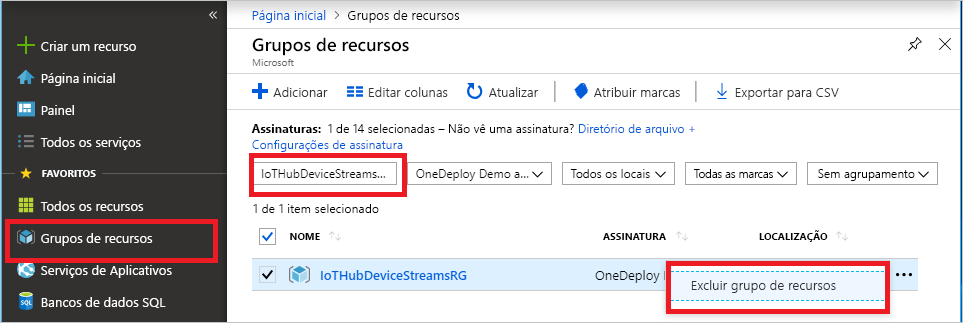

Se você pretende continuar para o próximo artigo recomendado, mantenha e reutilize os recursos já criados.

Caso contrário, para evitar encargos, exclua os recursos do Azure criados neste artigo.

> [!IMPORTANT]
> A exclusão de um grupo de recursos é irreversível. O grupo de recursos e todos os recursos contidos nele são excluídos permanentemente. Não exclua acidentalmente grupo de recursos ou recursos incorretos. Se você criou o hub IoT em um grupo de recursos existente que contém recursos que você deseja manter, exclua só o próprio recurso do hub IoT, não o grupo de recursos.
>

Para excluir um grupo de recursos por nome:

1. Entre no [portal do Azure](https://portal.azure.com) e selecione **Grupos de recursos**.

1. Na caixa **Filtrar por nome**, insira o nome do grupo de recursos que contém o hub IoT.

1. Na lista de resultados, à direita do grupo de recursos, selecione as reticências ( **...** ) e, em seguida, selecione **Excluir grupo de recursos**.

    

1. Para confirmar a exclusão do grupo de recursos, insira novamente o nome do grupo de recursos e, em seguida, selecione **Excluir**. Após alguns instantes, o grupo de recursos e todos os recursos contidos nele serão excluídos.
