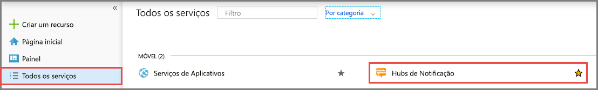
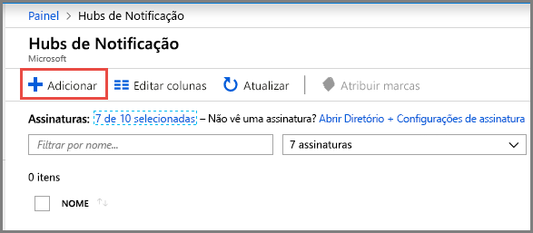
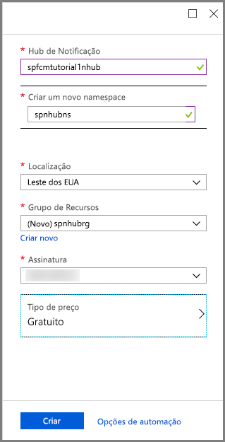
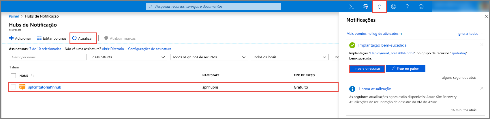
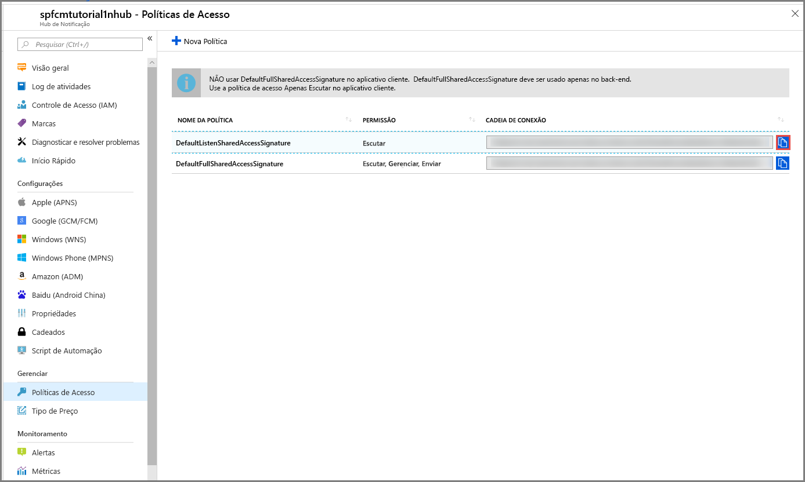

1. Entre no [Portal do Azure](https://portal.azure.com).

1. Selecione **Todos os serviços** no menu à esquerda e **Hubs de Notificação** na seção **Móvel**. Selecione o ícone de estrela ao lado do nome do serviço para adicionar o serviço na seção **FAVORITOS** no menu à esquerda. Depois de adicionar os **Hubs de Notificação** a **FAVORITOS**, selecione-o no menu à esquerda.

      

1. Na página **Hubs de Notificação**, selecione **Adicionar** na barra de ferramentas.

      

1. Na página **Hub de Notificação**, execute as seguintes etapas:

    1. Insira um nome em **Hub de Notificação**.  

    1. Insira um nome em **Criar um namespace**. Um namespace contém um ou mais hubs.

    1. Selecione um valor da caixa de listagem suspensa **Local**. Esse valor especifica a localização na qual você deseja criar o hub.

    1. Selecione grupo de recursos existente em **Grupo de Recursos** ou crie um nome para um novo grupo de recursos.

    1. Selecione **Criar**.

        

1. Selecione **Notificações** (ícone de sino) e selecione **Acessar recurso**. Atualize também a lista na página **Hubs de Notificação** e, em seguida, selecione seu hub.

      

1. Selecione **Políticas de Acesso** na lista. Observe que as cadeias de caracteres de duas conexão estão disponíveis para você. Você precisará delas para manipular notificações por push mais tarde.

      >[!IMPORTANT]
      >*Não* use a política **DefaultFullSharedAccessSignature** em seu aplicativo. Ela é destinada a ser usada apenas em seu back-end.
      >

      
