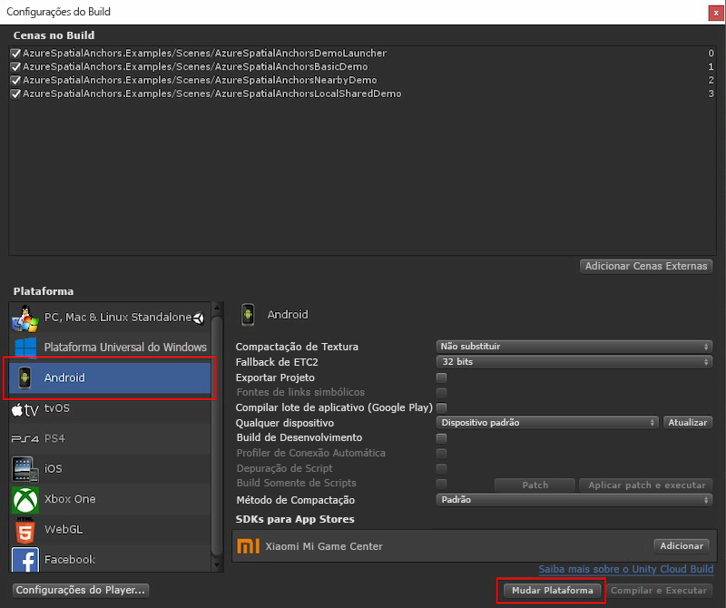

Abra **Configurações de Build** selecionando **Arquivo** > **Configurações de Build**.

Na seção **Plataforma**, selecione **Android**. Altere o **Sistema de compilação** para **Gradle** e certifique-se de que a caixa de seleção **Exportar projeto** não esteja marcada.

Selecione **Mudar Plataforma** para alterar a plataforma para **Android**. O Unity poderá solicitar que você instale componentes de suporte Android, se estiverem faltando.

Feche a janela **Configurações de Build**.

### Baixar e importar o SDK do ARCore para Unity

Baixe o arquivo `unitypackage` do [SDK do ARCore para versões 1.7 do Unity](https://github.com/google-ar/arcore-unity-sdk/releases/tag/v1.7.0). De volta no projeto do Unity, selecione **Ativos** > **Importar Pacote** > **Pacote Personalizado...** e, em seguida, selecione o arquivo `unitypackage` baixado anteriormente. Na caixa de diálogo **Importar Pacote do Unity**, verifique se todos os arquivos estão selecionados e, em seguida, selecione **Importar**.
