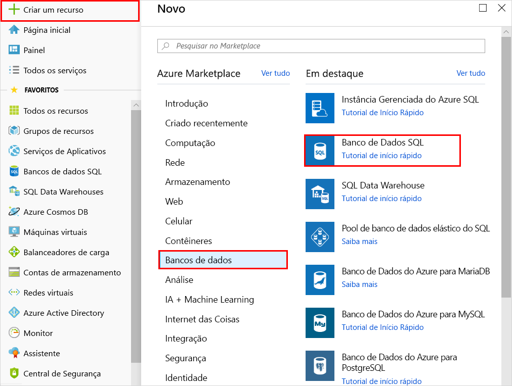
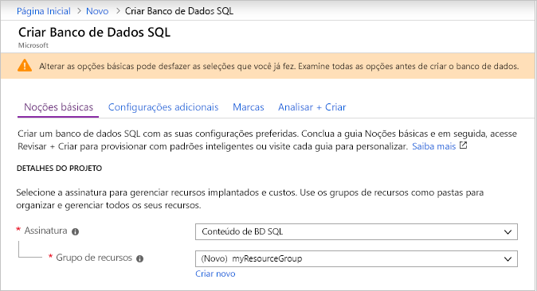
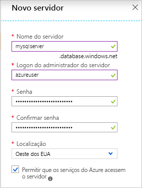
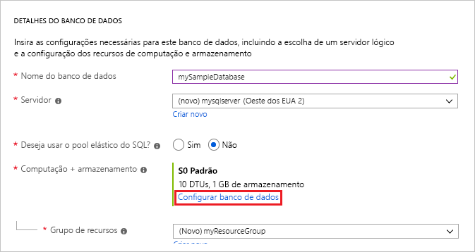
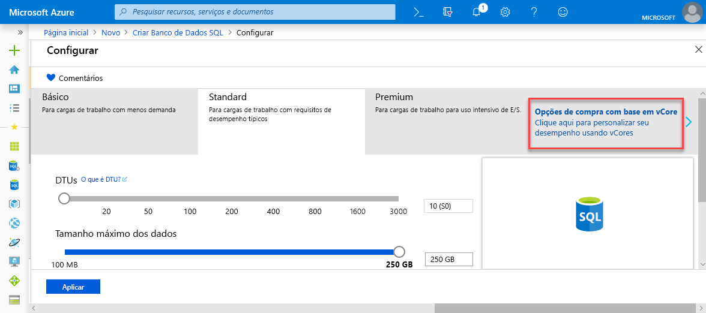
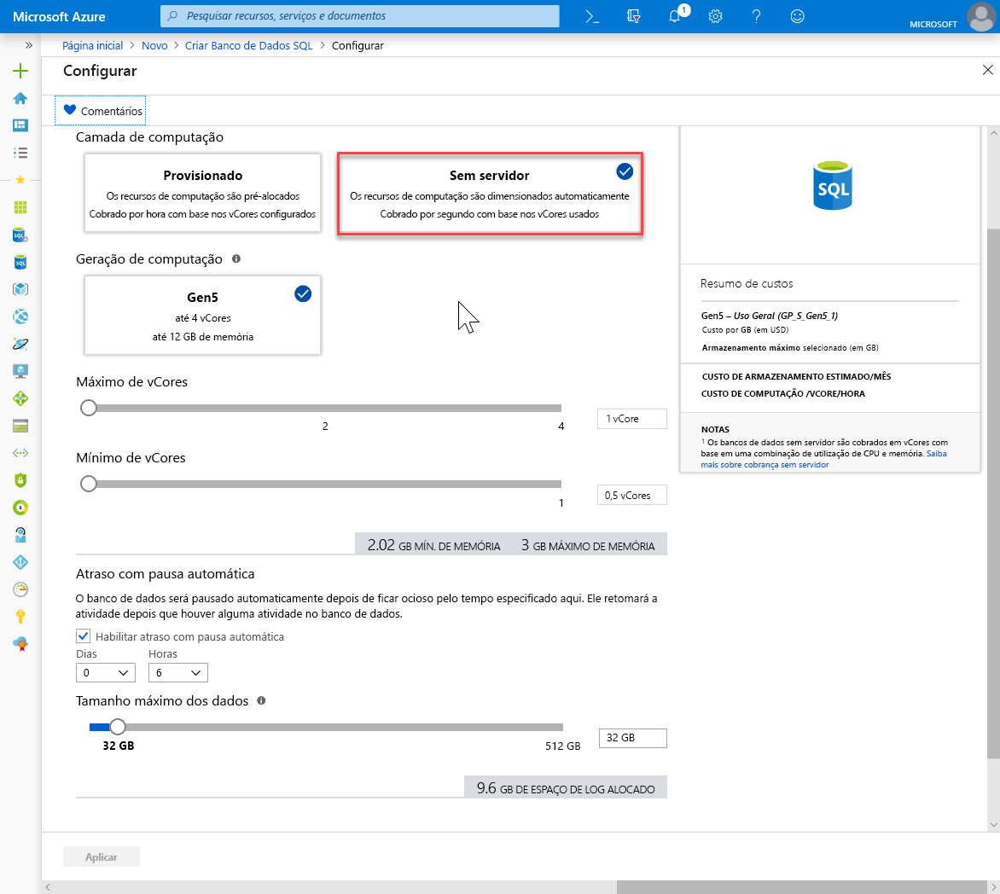
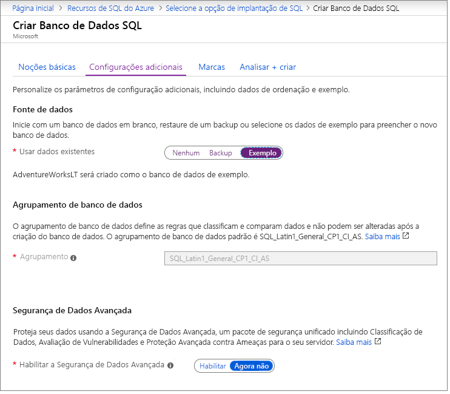

Nesta etapa, você criará seu grupo de recursos e um banco de dados SQL do Azure. 

> [!IMPORTANT]
> Certifique-se de configurar as regras de firewall para usar o endereço IP público do computador no qual você está executando as etapas neste artigo. As regras de firewall no nível do banco de dados serão replicadas automaticamente para o servidor secundário.
>
> Para obter informações, confira [Criar uma regra de firewall de nível de banco de dados](/sql/relational-databases/system-stored-procedures/sp-set-database-firewall-rule-azure-sql-database) ou, para determinar o endereço IP usado para a regra de firewall de nível de servidor para seu computador, confira [Criar um firewall de nível de servidor](../articles/sql-database/sql-database-server-level-firewall-rule.md).  

# <a name="azure-portaltabazure-portal"></a>[Portal do Azure](#tab/azure-portal)
Crie seu grupo de recursos e um banco de dados individual usando o portal do Azure. 

1. Selecione **Criar um recurso** no canto superior esquerdo do portal do Azure.
2. Selecione **Bancos de Dados** e, em seguida, **Banco de Dados SQL** para abrir a página **Criar Banco de Dados SQL**.

   

3. Na guia **Informações Básicas** da seção **Detalhes do Projeto**, digite ou selecione os seguintes valores:

   - **Assinatura**: Selecione a lista suspensa e escolha a assinatura correta, caso ela não seja exibida.
   - **Grupo de recursos**: Selecione **Criar novo**, digite `myResourceGroup` e selecione **OK**.

     

4. Na seção **Detalhes do Banco de Dados**, digite ou selecione os seguintes valores:

   - **Nome do banco de dados**: Digite `mySampleDatabase`.
   - **Servidor**: Selecione **Criar novo**, insira os valores a seguir e, em seguida, escolha **Selecionar**.
       - **Nome do servidor**: Digite `mysqlserver`, juntamente com alguns números para exclusividade.
       - **Logon de administrador do servidor**: Digite `azureuser` no terminal integrado.
       - **Senha**: Digite uma senha complexa que atenda aos requisitos de senha.
       - **Localização**: Escolha uma localização na lista suspensa, como `West US 2`.

         

      > [!IMPORTANT]
      > Lembre-se de registrar o logon de administrador do servidor e a senha para fazer logon no servidor e nos bancos de dados deste e de outros inícios rápidos. Caso esqueça seu logon ou a senha, obtenha o nome de logon ou redefina a senha na página **SQL Server**. Para abrir a página **SQL Server**, selecione o nome do servidor na página **Visão Geral** do banco de dados após a criação do banco de dados.

        

   - **Deseja usar o pool elástico SQL?** : Selecione a opção **Não**.
   - **Computação + armazenamento**: Selecione **Configurar banco de dados** e, nesse início rápido, selecione as **opções de compra baseado em vCore**

     

   - Selecione **provisionado** e **Gen4**.

     

   - Examine as configurações para **Máx vCores**, **Mín vCores**, **Atraso de pausa automática** e **Tamanho máximo de dados**. Altere-as conforme desejado.
   - Aceite os termos de versão prévia e clique em **OK**.
   - Escolha **Aplicar**.

5. Selecione a guia **Configurações adicionais**. 
6. Na seção **Fonte de dados**, em **Usar dados existentes**, selecione `Sample`. 

   

   > [!IMPORTANT]
   > Selecione os dados da **Amostra (AdventureWorksLT)** para seguir com facilidade este e outros Guias de Início Rápido do Banco de Dados SQL do Azure que usam esses dados.

7. Mantenha o restante dos valores como padrão e selecione **Examinar + Criar** na parte inferior do formulário.
8. Examine as configurações finais e selecione **Criar**.

9. No formulário **Banco de Dados SQL**, selecione **Criar** para implantar e provisionar o grupo de recursos, o servidor e o banco de dados.

# <a name="powershelltabpowershell"></a>[PowerShell](#tab/powershell)

[!INCLUDE [updated-for-az](updated-for-az.md)]

Crie seu grupo de recursos e um banco de dados individual usando o PowerShell. 

   ```powershell-interactive
   # Set variables for your server and database
   $SubscriptionId = '<Your Azure subscription ID>'
   $ResourceGroupName = "myResourceGroup" # to randomize: "myResourceGroup-$(Get-Random)"
   $Location = "westus2"
   $AdminLogin = "azureuser"
   $Password = "ChangeYourAdminPassword1"
   $ServerName = "mysqlserver" # to randomize: "mysqlserver-$(Get-Random)"
   $DatabaseName = "mySampleDatabase"
   
   
   # The ip address range that you want to allow to access your server 
   #(leaving at 0.0.0.0 will prevent outside-of-azure connections to your DB)
   $startIp = "0.0.0.0"
   $endIp = "0.0.0.0"
   
   # Connect to Azure
   Connect-AzAccount

   # Set subscription ID
   Set-AzContext -SubscriptionId $subscriptionId 
   
   # Create a resource group
   $resourceGroup = New-AzResourceGroup -Name $ResourceGroupName -Location $Location
   
   # Create a server with a system wide unique server name
   $server = New-AzSqlServer -ResourceGroupName $ResourceGroupName `
      -ServerName $ServerName `
      -Location $Location `
      -SqlAdministratorCredentials $(New-Object -TypeName System.Management.Automation.PSCredential -ArgumentList $AdminLogin, $(ConvertTo-SecureString -String $Password -AsPlainText -Force))
   
   # Create a server firewall rule that allows access from the specified IP range
   $serverFirewallRule = New-AzSqlServerFirewallRule -ResourceGroupName $ResourceGroupName `
      -ServerName $ServerName `
      -FirewallRuleName "AllowedIPs" -StartIpAddress $startIp -EndIpAddress $endIp
   
   # Create General Purpose Gen4 database with 1 vCore
   $database = New-AzSqlDatabase  -ResourceGroupName $ResourceGroupName `
      -ServerName $ServerName `
      -DatabaseName $DatabaseName `
      -Edition GeneralPurpose `
      -VCore 1 `
      -ComputeGeneration Gen4  `
      -MinimumCapacity 1 `
      -SampleName "AdventureWorksLT"
   ```

# <a name="az-clitabbash"></a>[AZ CLI](#tab/bash)
Crie seu grupo de recursos e um banco de dados individual usando AZ CLI. 


   ```azurecli-interactive
   #!/bin/bash
   # Set variables
   export subscriptionID=<Your Subscription ID>
   export ResourceGroupName=myResourceGroup # to randomize: myResourceGroup-$RANDOM
   export Location=WestUS2
   export AdminLogin=azureuser
   export Password=ChangeYourAdminPassword1
   export ServerName="mysqlserver" # to randomize: mysqlserver-$RANDOM
   export DatabaseName=mySampleDatabase
   
   # The ip address range that you want to allow to access your DB. 
   # (leaving at 0.0.0.0 will prevent outside-of-azure connections to your DB)
   export startip=0.0.0.0
   export endip=0.0.0.0
  
   # Connect to Azure
   az login

   $ Set subscription ID
   az account set --subscription $SubscriptionID
   
   # Create a resource group
   az group create \
      --name $ResourceGroupName \
      --location $Location
   
   # Create a logical server in the resource group
   az sql server create \
      --name $ServerName \
      --resource-group $ResourceGroupName \
      --location $Location  \
      --admin-user $AdminLogin\
      --admin-password $Password
   
   # Configure a firewall rule for the server
   az sql server firewall-rule create \
      --resource-group $ResourceGroupName \
      --server $ServerName \
      -n AllowYourIp \
      --start-ip-address $startip \
      --end-ip-address $endip
   
   # Create a database in the server 
   az sql db create \
      --resource-group $ResourceGroupName \
      --server $ServerName \
      --name $DatabaseName \
      --sample-name AdventureWorksLT \
      --edition GeneralPurpose \
      --family Gen4 \
      --capacity 1 \
   ```

---