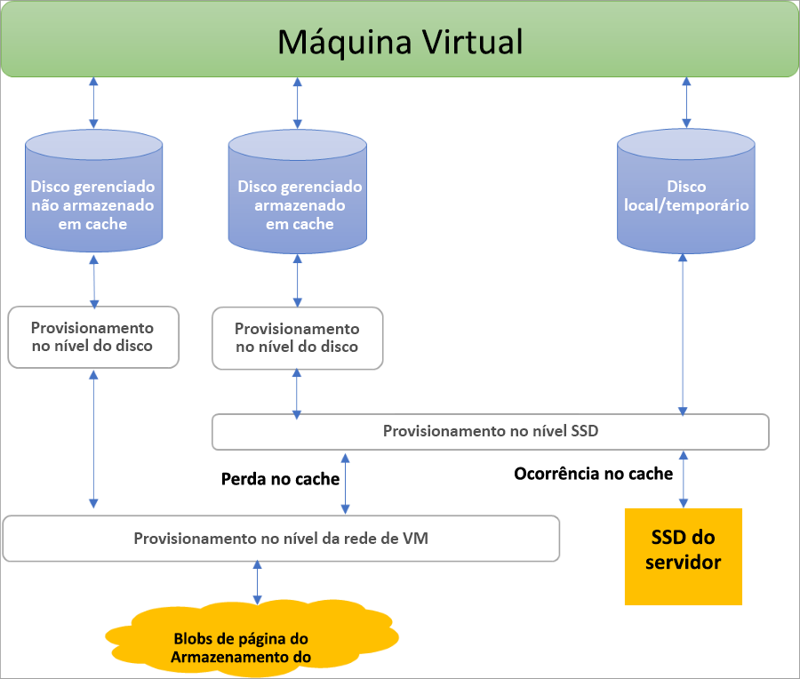
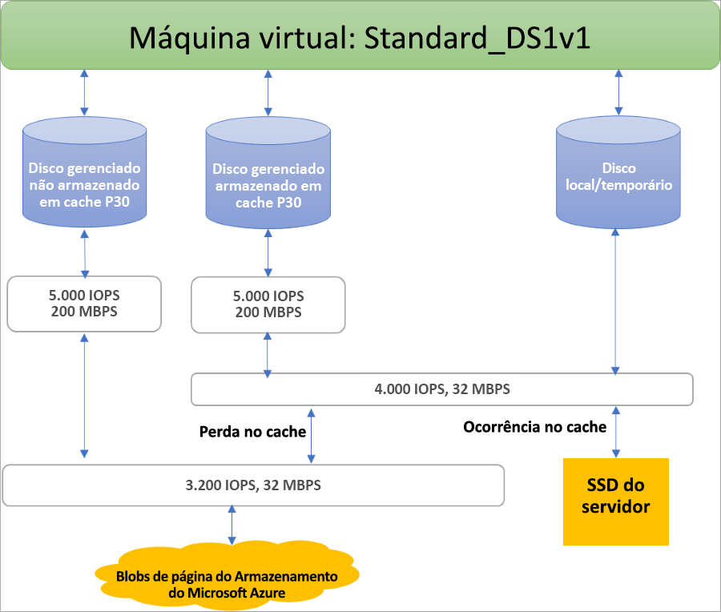

## Benefícios dos discos gerenciados

Vamos falar sobre alguns benefícios que você ganha usando discos gerenciados.

### Altamente durável e disponível

Os discos gerenciados foram criados para oferecer uma disponibilidade de 99,999%. Os discos gerenciados atingem isso fornecendo três réplicas dos seus dados, possibilitando alta durabilidade. Se uma ou duas réplicas apresentarem problemas, as réplicas restantes ajudarão a garantir a persistência dos seus dados e a alta tolerância contra falhas. Esta arquitetura ajudou o Azure a proporcionar consistentemente durabilidade de nível empresarial para discos IaaS (Infraestrutura como serviço), com uma taxa de falha anualizada líder do setor de ZERO POR CENTO.

### Implantação simples e escalonável de VM

Usando discos gerenciados, é possível criar até 50 mil **discos** de VM de um tipo em uma assinatura por região, permitindo que você crie milhares de **VMs** em uma assinatura única. Esse recurso também aumenta a ainda mais escalabilidade dos [conjuntos de dimensionamento de máquinas virtuais](../articles/virtual-machine-scale-sets/virtual-machine-scale-sets-overview.md), permitindo que você crie até mil VMs em um conjunto de dimensionamento de máquinas virtuais usando uma imagem do Marketplace.

### Integração com conjuntos de disponibilidade

Os discos gerenciados são integrados a conjuntos de disponibilidade para garantir que os discos de [VMs em um conjunto de disponibilidade](../articles/virtual-machines/windows/manage-availability.md#use-managed-disks-for-vms-in-an-availability-set) estejam suficientemente isolados entre si para evitar pontos únicos de falha. Os discos são automaticamente colocados em unidades de escala de armazenamento diferentes (carimbos). Se um carimbo falhar devido a uma falha de hardware ou de software, somente as instâncias da VM com discos nesses carimbos falharão. Por exemplo, vamos supor que você tenha um aplicativo em execução em cinco VMs, e que as VMs estejam em um Conjunto de Disponibilidade. Os discos dessas VMs não serão armazenados no mesmo stamp, portanto, se um stamp ficar inativo, as outras instâncias do aplicativo continuarão em execução.

### Integração com as Zonas de Disponibilidade

Os discos gerenciados dão suporte às [Zonas de Disponibilidade](../articles/availability-zones/az-overview.md), que são uma oferta de alta disponibilidade que protege os aplicativos contra falhas do datacenter. As Zonas de Disponibilidade são locais físicos exclusivos em uma região do Azure. Cada zona é composta por um ou mais datacenters equipados com energia, resfriamento e rede independentes. Para garantir a resiliência, há um mínimo de três zonas separadas em todas as regiões habilitadas. Com Zonas de Disponibilidade, o Azure oferece o melhor SLA de tempo de atividade da VM de 99,99% do setor.

### Suporte de Backup do Azure

Para proteger contra desastres regionais, o [Backup do Azure](../articles/backup/backup-overview.md) pode ser usado para criar um trabalho de backup com backups baseados em tempo e políticas de retenção de backup. Isso permite que você execute restaurações de VM fáceis à vontade. No momento, o Backup do Azure dá suporte a tamanhos de disco de até quatro TiB (tebibytes).  O Backup do Azure é compatível com o backup e a restauração de discos gerenciados. [Saiba mais](../articles/backup/backup-support-matrix-iaas.md) sobre o suporte de backup da VM do Azure.

### Controle de acesso granular

É possível usar o [RBAC (Controle de acesso baseado em função) do Azure](../articles/role-based-access-control/overview.md) para atribuir permissões específicas de um disco gerenciado a um ou mais usuários. Os discos gerenciados expõem uma variedade de operações, incluindo leitura, gravação (criar/atualizar), exclusão e recuperação de um [URI de SAS (assinatura de acesso compartilhado)](../articles/storage/common/storage-dotnet-shared-access-signature-part-1.md) para o disco. Conceda acesso somente às operações que uma pessoa necessita para executar seu trabalho. Por exemplo, se não quiser que uma pessoa copie um disco gerenciado em uma conta de armazenamento, opte por não conceder acesso à ação de exportação para esse disco gerenciado. Da mesma forma, se não quiser que uma pessoa use um URI de SAS para copiar um disco gerenciado, opte por não conceder essa permissão ao disco gerenciado.

## Criptografia

Os discos gerenciados oferecem dois tipos diferentes de criptografia. O primeiro é o SSE (Criptografia do Serviço de Armazenamento), que é executado pelo serviço de armazenamento. O segundo é o Azure Disk Encryption, que pode ser habilitado nos discos do sistema operacional e de dados das VMs.

### SSE (Criptografia do Serviço de Armazenamento)

A [Criptografia do Serviço de Armazenamento do Azure](../articles/storage/common/storage-service-encryption.md) fornece criptografia em repouso e protege seus dados para atender aos compromissos de conformidade e segurança da organização. O SSE está habilitado por padrão para todos os discos gerenciados, instantâneos e imagens em todas as regiões nas quais os discos gerenciados estão disponíveis. Visite o [página de Perguntas frequentes do Managed Disks](../articles/virtual-machines/windows/faq-for-disks.md#managed-disks-and-storage-service-encryption) para obter mais detalhes.

### ADE (Azure Disk Encryption)

O Azure Disk Encryption permite criptografar os discos do sistema operacional e os discos de dados usados por uma Máquina Virtual IaaS. Essa criptografia inclui discos gerenciados. No Windows, as unidades são criptografadas usando a tecnologia de criptografia BitLocker padrão do setor. No Linux, os discos são criptografados usando a tecnologia DM-Crypt. Esse processo de criptografia é integrado ao Azure Key Vault para permitir que você controle e gerencie as chaves de criptografia de disco. Para saber mais, confira [Azure Disk Encryption para VMs IaaS](../articles/security/azure-security-disk-encryption-overview.md).

## Funções do disco

Há três funções principais de disco no Azure: o disco de dados, o disco do SO e o disco temporário. Essas funções são mapeadas para discos anexados à sua máquina virtual.

### Disco de dados

Um disco de dados é um disco gerenciado anexado a uma máquina virtual para armazenar dados de aplicativos ou outros dados que precisam ser mantidos. Discos de dados são registrados como unidades SCSI e rotulados com a letra que você escolher. Cada disco de dados tem uma capacidade máxima de 32.767 GiB (gibibytes). O tamanho da máquina virtual determina quantos discos de dados você pode anexar a ele e o tipo de armazenamento que pode usar para hospedar os discos.

### Disco do sistema operacional

Cada máquina virtual tem um disco de sistema operacional anexado. Esse disco do sistema operacional tem um SO pré-instalado, que foi selecionado quando a VM foi criada.

Esse disco tem uma capacidade máxima de 2.048 GiB.

### Disco temporário

Cada VM contém um disco temporário, que não é um disco gerenciado. O disco temporário fornece armazenamento de curto prazo para aplicativos e processos e destina-se apenas a armazenar dados, como arquivos de paginação ou de permuta. Os dados no disco temporário podem ser perdidos durante um [evento de manutenção](../articles/virtual-machines/windows/manage-availability.md?toc=%2fazure%2fvirtual-machines%2fwindows%2ftoc.json#understand-vm-reboots---maintenance-vs-downtime) ou durante a [reimplantação de uma VM](../articles/virtual-machines/troubleshooting/redeploy-to-new-node-windows.md?toc=%2Fazure%2Fvirtual-machines%2Fwindows%2Ftoc.json). Em VMs do Linux do Azure, o disco temporário é /dev/sdb por padrão e, em VMs do Windows, o disco temporário é D: por padrão. Durante uma reinicialização padrão bem-sucedida da VM, os dados no disco temporário devem persistir.

## Instantâneos de disco gerenciado

Um instantâneo de disco gerenciado é uma cópia completa consistente com falhas e somente leitura de um disco gerenciado que, por padrão, é armazenada como um disco gerenciado padrão. Com os instantâneos, você pode fazer backup de seus discos gerenciados a qualquer momento. Esses instantâneos existem independentemente do disco de origem e podem ser usados para criar novos discos gerenciados. Eles são cobrados com base no tamanho usado. Por exemplo, se você criar um instantâneo de um disco gerenciado com capacidade provisionada de 64 GiB e tamanho real de dados usados de 10 GiB, esse instantâneo será cobrado apenas pelo tamanho de dados usados de 10 GiB.  

Para saber mais sobre como criar instantâneos com discos gerenciados, confira os seguintes recursos:

* [Criar cópia de VHD armazenada como um disco gerenciado usando instantâneos no Windows](../articles/virtual-machines/windows/snapshot-copy-managed-disk.md)
* [Criar cópia de VHD armazenada como um disco gerenciado usando instantâneos no Linux](../articles/virtual-machines/linux/snapshot-copy-managed-disk.md)

### Imagens

Os discos gerenciados também dão suporte à criação de uma imagem personalizada gerenciada. É possível criar uma imagem do seu VHD personalizado em uma conta de armazenamento ou diretamente de uma VM generalizada (por meio do sysprep). Esse processo captura uma única imagem. Essa imagem contém todos os discos gerenciados associados a uma VM, incluindo os discos do SO e de dados. Esta imagem personalizada gerenciada permite a criação de centenas de VMs usando sua imagem personalizada, sem a necessidade de copiar ou gerenciar contas de armazenamento.

Para saber mais sobre a criação de imagens, confira os artigos a seguir:

* [Como capturar uma imagem gerenciada de uma VM generalizada no Azure](../articles/virtual-machines/windows/capture-image-resource.md)
* [Como generalizar e capturar uma máquina virtual Linux usando a CLI do Azure](../articles/virtual-machines/linux/capture-image.md)

#### Imagens versus instantâneos

É importante compreender a diferença entre imagens e instantâneos. Com discos gerenciados é possível capturar uma imagem de uma VM generalizada que foi desalocada. Essa imagem inclui todos os discos anexados à VM. É possível usar essa imagem para criar uma VM e isso inclui todos os discos.

Um instantâneo é uma cópia de um disco no momento exato em que o instantâneo é tirado. Ele só se aplica a um disco. Se você tiver uma VM que tem um disco (o disco do SO), será possível capturar um instantâneo ou uma imagem dele e criar uma VM com base no instantâneo ou na imagem.

Um instantâneo não tem reconhecimento de nenhum disco, exceto o contido por ele. Isso torna problemático usá-lo em cenários que precisam da coordenação de vários discos, como distribuição. Os instantâneos precisariam ser capazes de coordenar uns com os outros e, no momento, não há suporte para isso.

## Desempenho e alocação de disco

O diagrama a seguir ilustra a alocação em tempo real de largura de banda e IOPS para discos, usando um sistema de provisionamento de três níveis:

O provisionamento do primeiro nível define a atribuição de IOPS e de largura de banda por disco.  No segundo nível, o host do servidor de computação implementa o provisionamento de SSD, aplicando-o aos dados armazenados no SSD do servidor, que inclui discos com armazenamento em cache (ReadWrite e ReadOnly), bem como discos locais e temporários. Por fim, o provisionamento da rede de VMs ocorre no terceiro nível para qualquer E/S que o host de computação envia para o back-end do Armazenamento do Azure. Com esse esquema, o desempenho de uma VM depende de uma variedade de fatores, desde a maneira como a VM usa o SSD local até o número de discos anexados, bem como o tipo de desempenho e de cache dos discos que ele anexou.

Como um exemplo dessas limitações, uma VM Standard_DS1v1 é impedida de alcançar o potencial de 5 mil IOPS de um disco P30, esteja em cache ou não, devido aos limites nos níveis do SSD e de rede:

O Azure usa um canal de rede priorizado para tráfego de disco, que prevalece sobre outra baixa prioridade do tráfego de rede. Isso ajuda os discos a manter o desempenho esperado em caso de contenções de rede. Da mesma forma, o Armazenamento do Azure lida com contenções de recursos e com outros problemas em segundo plano com balanceamento de carga automático. O Armazenamento do Azure aloca os recursos necessários quando você cria um disco e aplica o balanceamento proativo e reativo de recursos para lidar com o nível de tráfego. Com isso, os discos podem sustentar seus destinos de IOPS e de taxa de transferência esperados. Você pode usar as métricas em nível de VM e de disco para acompanhar o desempenho e os alertas de configuração, conforme necessário.

Confira nosso artigo de [design para alto desempenho](../articles/virtual-machines/windows/premium-storage-performance.md) para aprender as melhores práticas para otimizar as configurações de VM + Disco para que você possa atingir o desempenho desejado

## Próximas etapas

Saiba mais sobre os tipos de disco individual oferecidos pelo Azure, qual tipo é uma boa opção para suas necessidades e sobre os destinos de desempenho em nosso artigo sobre tipos de disco.
